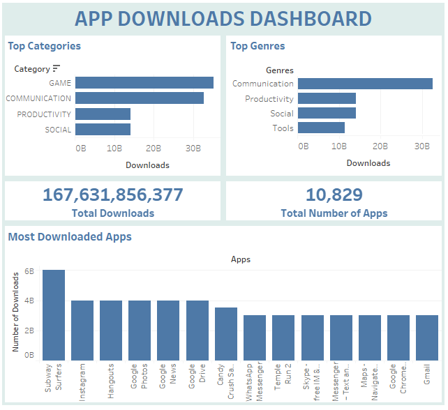
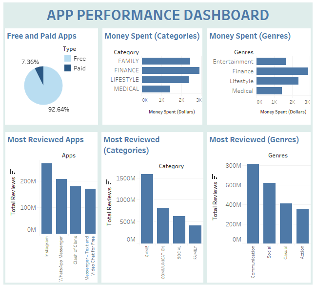

# Playstore Data Analysis

## Overview
* In this project, the distribution of applications in relation to categories and genres and whether they're paid or free is explored.
* Information on the money spent by consumers buying applications, as well as the review activities are obtained.
* Derived conclusions can help app developers gain an understanding on how to capture the market.
* PostgreSQL and Tableau are the tools used.

## Objectives
The aim is to build dashboards to visualise the distribution of application downloads, purchases and reviews across individual applications, categories and genres.

## Deliverables
<table>
<colgroup>
<col width="30%" />
<col width="30%" />
<col width="40%" />
</colgroup>
<thead>
<tr class="header">
<th>Demand</th>
<th>Value</th>
<th>Deliverable</th>
</tr>
</thead>
<tbody>
<tr>
<td markdown="span">A dashboard that summarises application downloads</td>
<td markdown="span">To understand which apps, categories and genres are the most popular in terms of downloads</td>
<td markdown="span">A dashboard visualising disribution of downloads across different applications, genres and categories as well as the total download numbers</td>
</tr>
<tr>
<td markdown="span">A dashboard with information on money spent on applications and review activities of applications</td>
<td markdown="span">To understand which are the categories where money is spent the most as well as the customer activities in terms of reviews</td>
<td markdown="span">A dashboard visualising disribution of amount spent and total reviews (per application) across genres and categories</td>
</tr>
</tbody>
</table>

## Data Preparation
Data was obtained from googleplaystore.csv dataset taken from kaggle (Author: Lavanya, Updated on 03/02/2019). To acess the source [CLICK HERE](https://www.kaggle.com/lava18/google-play-store-apps):

The data transformation and cleaning was done in PostgreSQL. Data with null values were removed for columns with few null values. Rating column contained large amount of null values and they were replaced with zeros. There were certain columns such as price and installs, where numerical information was in text format (with some additional string values such as '+', 'M' etc.). The string values were removed and the data were converted to double precision type. The data was exported into a new table (playstore_data_final) which was then used in Tableau for visualisation.

The SQL queries can be found [HERE](https://github.com/nihalhabeeb/Playstore_data_analysis/tree/main/Query).

## Data Visualisation
Data visualisation was done in Tableau. The dashboards were created.

#### App Downloads Dashboard:
Presents the distribution of application downloads across categories and genres. Provides information on the total download activity as well as the total number of applications.
[DASHBOARD LINK](https://public.tableau.com/views/APPPERFORMANCEDASHBOARD/appperf_db?:language=en-US&publish=yes&:display_count=n&:origin=viz_share_link)

#### App Performance Dashboard:
Visualises the distribution of free and paid apps as well as the money spent across categories and genres. The relation of review activities with categories and genres is explored as well.
[DASHBOARD LINK](https://public.tableau.com/views/APPPERFORMANCEDASHBOARD/appperf_db?:language=en-US&publish=yes&:display_count=n&:origin=viz_share_link)

## Conclusions
**Note:** The dataset was updated in 2019 and the trends are relevant to that time period (The project is for educational purpose and not for making decisions for the current market situation).

* The category with the most downloads is Games and the genre with the most downloads is Communication.
* Subway Surfers (Game) followed by Instagram and Hangouts are the most downloaded applications.
* Only 7.36% of the applications are paid.
* The category were the most money is spent is Finance and the genre were the most money is spent is Finance as well.
* Instagram is the most reviewed application.
* Games category and Communication genre has the most reviews.
* Categories and genres are loosely similar.
